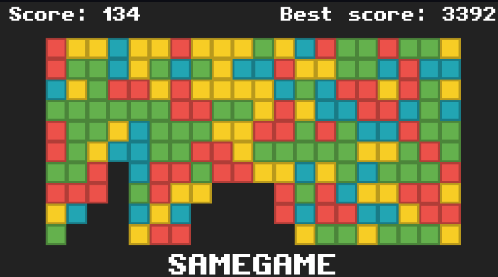
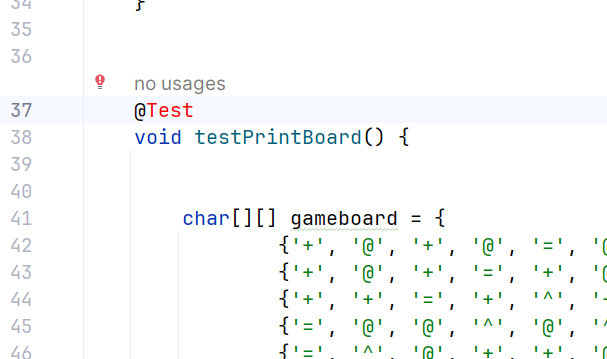
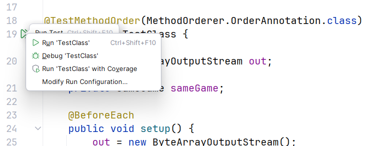
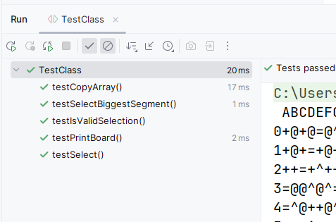
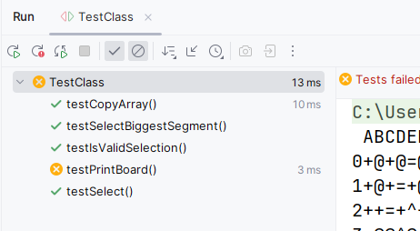

# COMP2045 Programming Assignment 1 - Block Puzzle Game 

## 2025-26 Semester 1

* Designed by: [Dr. Kevin Wang](mailto:kevinw@comp.hkbu.edu.hk)
* Q & A: [Discord](https://discordapp.com/channels/1004554070083776672/1004554070083776678)
* Assignment Website: [GitHub](https://github.com/khwang0/COMP2045-2526PA1)
* Due: 
  * UAT Due: 23:59pm 4/10/2025 (Saturday midnight) -- updated
  * Programming Due: 23:59pm 12/10/2025 (Sunday midnight)
* Download the starter code: [SameGame.java](SameGame.java) 
* Download the demo program: [here](demo.jar)
* Download everything from the assignment: [here](https://github.com/khwang0/COMP2045-2526PA1/archive/refs/heads/master.zip)

> To run the demo program, type the following in your terminal:
> 
> ```sh
> > java -jar demo.jar
> ```
> or running another version of the demo program by
> ```sh
> > java -jar demo2.jar 
> ```



<sub><sup>

image ref: [Crazygame.com](https://www.crazygames.com/game/samegame) 

</sup></sub>

# Learning outcome

Students are expected to have some practice on arrays/2D arrays/parameter passing/method construction and usage in this assignment. We expect most students would spend ten hours or more to finish the assignment without any assistance. Make sure you start earlier as possible and ask us on Discord if you have any difficulty! Note: we want to familiarize arrays and 2D arrays, so you are not supposed (and not allowed) to use advanced data structures like ArrayList, Set, Map, etc... 


# Introduction

You are going to complete the SameGame program! Open [SameGame.java](SameGame.java) and complete the methods stated in the skeleton code. Some of these methods are very straightforward while some of them ain't that easy. Make sure you can follow the instructions given at the top of each method.

A [sample program](demo.jar) is given to you. When there is something you are not sure, you can take a look at the sample program to decide what to do. 

Some methods are labeled as completed or given. Please don't make any change on those methods. You are not supposed to modify them. **You can add your own method if you want to**. However, you are not allowed to introduce any class variable (field) or additional class. Whenever possible, please refer the constant variables (`SYMBOLS`, `EMPTY`, `SELECTED`..) defined in the program.

## Explanation of the game Block Puzzle

> Try the game here: https://www.crazygames.com/game/same-game

The game in the above links give you an idea of how the game works. Basically you need to select blocks that has at least one adjacent block with the same symbols. Once you select a block, all the blocks with the same symbols will be selected. You can then remove the selected blocks and the remaining blocks will raise to fill the empty space. The game ends when there is no more block that can be selected or the board is cleared. The scoring method is described in the code. 


## Explanation about the assignment

You are given the skeleton code. Complete all methods in the assignment with respect to the instructions stated in the Java file.


## `TestClass` class

You don't need to do anything with this java file. The purpose of this file is to conduct some *unit test* for your code. If you are using IntelliJ, you should be able to use this file within a few quick steps. By looking at this file, you should have some ideas of how the TA grade your work!

1. Open the file `TestClass.java`
2. Click on the word `@Test`.
 
 

3. Click the red bulb and select `Add JUnit5.x.x to classpath`.
 
 

4. Click the arrow on the left of `public class TestClass` and select `Run Tests`.
 
 

5. You shall see the following screen if there isn't any problem
 
   

6. Or you will see some error if your code does not perform what it is suppose to do. For example in the figure below, the test case `testPrintBoard` is not working properly.

 

> Note: If you are struggle with this file (e.g. cannot compile your code), simply delete this file. 

# Understanding the Assignment Test (UAT)

This part is independent to your programming code. You will need to answer the following short questions by **another due date**.
Submit your answers on Moodle. 

1. Which method is responsible to print the game board?
2. Which method is responsible to decide if the game ends?
3. What score should I get if I clear 10 blocks and shrink one column at the same time?
4. How many different types of symbols are there in the demo program (including empty symbol and selected symbols)?
5. What should I type to the computer if I want to place a puzzle at 3-rd row , 4-th column?

---


# Submission 
For submission upload the file `SameGame.java` to Moodle.  

Please be reminded that both the **Late Penalty Rule** and the **Penalty for Plagiarism** are applied strictly to all submissions of this course (including this assignment).   

Your assignment will be graded by some test cases created by the teaching team. Each method will be graded separately. You will lose points if you failed a test case even if the program can do the task as a whole (which in this case you may have placed the logic of a method outside the method required). Only some of the test cases will be given to you in the `TestClass.java` file. 

We will compile your code using Java 11 SDK. You are not allowed to use any advanced data structure such as `java.util.List`, `java.util.ArrayList`, `java.util.Arrays`, `java.util.Set`, `java.util.Map` etc. You are only allowed to use primitive arrays (1D or 2D) in this assignment. Additionally, the keyword `var` is not allowed in this assignment.

### Late Penalty Rule

```java
if (lateHour > 0) {
    if (lateHour < 24) 
        mark *= 0.8;
    else if (lateHour < 48)
        mark = mark >> 1;
        else if (lateHour < 72)
            mark = mark >> 2;
            else
                mark &= 0;
}
```


 ## Plagiarism

 Plagiarism is a serious offense and can be easily detected. Please don't share your code to your classmate even if they are threatening you with your friendship. If they don't have the ability to work on something that can compile, they would not be able to change your code to a state that we can't detect the act of plagiarism. For the first commit of plagiarism, regardless you shared your code or copied code from others, you will receive 0 with an addition of 5-mark penalty. If you commit plagiarism twice, your case will be presented in the exam board and you will receive a F directly.


> # Terms about Generative AI
> You are not allowed to use any generative AI in this assignment.
> The reason is straight forward. If you use generative AI, you are
> unable to practise your coding skills. We would like you to get
> familiar with the syntax and the logic of the Java programming.
> We will examine your code using detection software as well as 
> inspecting your code with our eyes. Using generative AI tool 
> may fail your assignment.

## Marking Scheme 
This assignment is worth 14% of the course mark.  There are three elements in the marking scheme: 
* 5% - Understanding the Assignment Test (UAT)
* 10% - the program can be compiled without any error
* 85% - a working program that functions as specified 
* -50% - if you define any class variable (field), addition class, or change the method `main`.
* -30% - if you use any advanced data structure such as `java.util.List`, `java.util.ArrayList`, `java.util.Arrays`, `java.util.Set`, `java.util.Map` etc to replace your primitive array.


Please note that submitting a program that cannot be compiled would result in a very low mark. 

For the correctness of your program, we will test your program with a set of test cases.  The test cases will be similar to the sample program.  All test cases will be released after the submission deadline.  
 

## Interview 
Should the teaching team see fit, students may be requested to attend an interview to explain about their program.  Students failing to attend such interview or to demonstrate a good understanding of their own program may result in mark deduction. 


